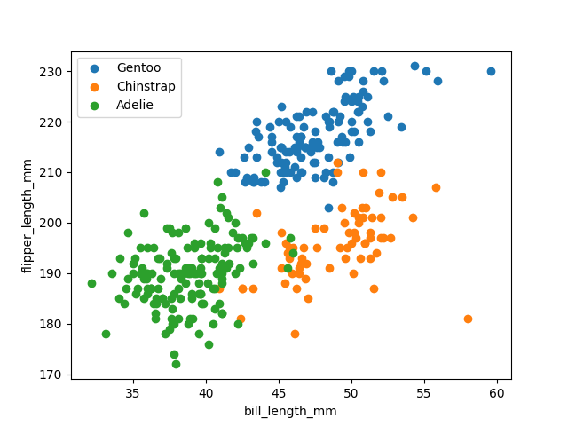

# Penguins Biometrics

## Overview
This analysis aims to compare three species of penguins : **Gento**, **Adelie** and **Chinstrap** in some islands of Antratica.
this study compares the feature of **body length** against the 2 features of **body depth** and **flipper length** stored in the database.

## Data

https://raw.githubusercontent.com/allisonhorst/palmerpenguins/master/inst/extdata/penguins.csv

## Running The Code
A [Makefile] has been created to streamline code compilation. To execute, clone the hw1-penguins-pgazar repository to your local drive & run the makefile outlined below:
1. Download data
    - make data
2. Create 2 scatter plots and save .png files to the 'img' directory
    - make scatter

## Output

[output](img/2.png)

